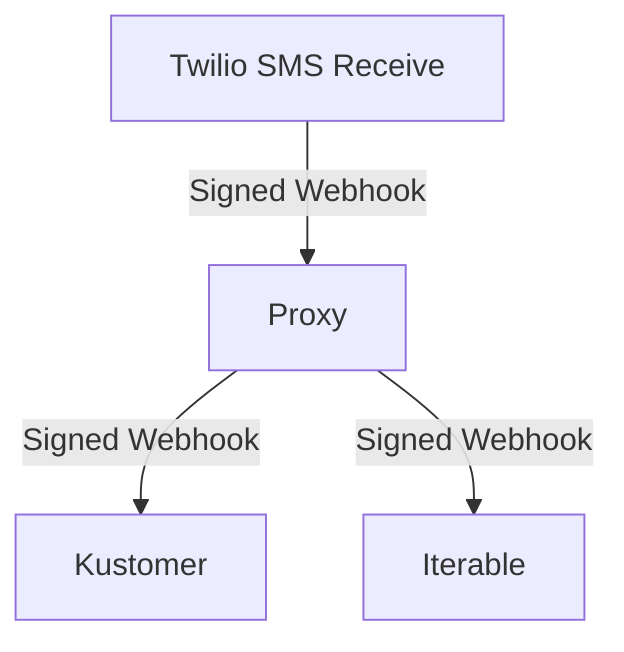

# Twilio Webhook Proxy

Use Twilio runtime functions to send a Twilio webhook to multiple destinations.

**This is not affiliated with Twilio in any way.**

## Development

    npm start -- --ngrok

## Deployment

Assuming valid Twilio credentials are provided, in local .env file

    npm deploy

## Diagram

