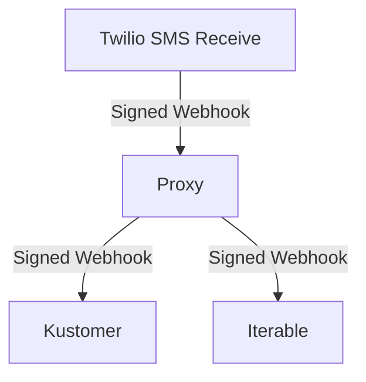

# Twilio Webhook Proxy

[](https://circleci.com/gh/affect-therapeutics/twilio-webhook-proxy/tree/main)

Use Twilio runtime functions to send a Twilio webhook to multiple destinations.

**This is not affiliated with Twilio in any way.**

## Environment Management

Environment files are encrypted using SOPS. To work with them:

```bash
service env decrypt staging     # Decrypt for local development
service env encrypt staging     # Encrypt after changes
service env edit staging        # Edit encrypted file directly
```

## Development

```bash
service start -- --ngrok
# or: npm start -- --ngrok
```

The `service` command proxies to npm scripts, so `service test`, `service start`, etc. work automatically.

## Deployment

```bash
service env decrypt production  # Decrypt production env first
service deploy                  # Deploy to staging
service deploy-prod             # Deploy to production
```

**WARNING:** The decrypted `.env.production` file is uploaded to Twilio as env variables

## Diagram


